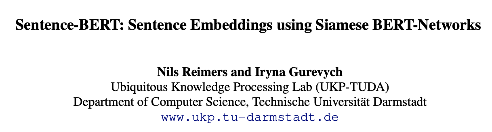

# DS/AI 부트캠프 - 개인 프로젝트 개요 
(최신순)

## [네 번째 프로젝트]: 사무실 일상 챗봇 <사무실 너머머> 구현  
- 작성: 2022년 12월 2일   
- 코드 파일: [ai_15_공주_s4_code.ipynb](https://github.com/kongju7/my_project4/blob/master/ai_15_%EA%B3%B5%EC%A3%BC_s4_code.ipynb)
- 챗봇 파일: [chatbot.py](https://github.com/kongju7/my_project4/blob/master/chatbot.py)

### 프로젝트 개요

1. 주제 및 데이터 소개: 자연어 처리 활용 챗봇 만들기 
  - **챗봇(chatbot)**: 사람과 텍스트나 음성으로 대화를 나눌 수 있는 프로그램 
     - 가파른 성장세: 연평균 성장률(전망) 23.5% (Marketsandmarkets, 2020)
     - '24시간 고객응대' 등을 통한 고객의 만족도 향상 및 비용 절감 
     - 딥러닝 자연어 처리(NLP) 기술 등과 결합 → 성능 크게 향상, 다양한 분야 적용 가능 
  - 데이터 : AI Hub 한국어 대화 데이터셋 - 오피스 데이터 (총 4개 파일)
     - 출처: https://aihub.or.kr/aihubdata/data/view.do?currMenu=115&topMenu=100&dataSetSn=272
  - 문장 유사도 기반 챗봇: 사무실 일상 챗봇 <사무실 너머머>

2. 자연어 처리 모델 소개: Sentence-BERT 

  - **Sentence-BERT**: 대표적인 ‘언어 모델(language model)’인 BERT 모델(Google, 2018년 발표)에 미세학습조정 (fine-tuning)을 통해 문장 임베딩의 ‘성능’과 ‘속도’를 개선시킨 모델. 문장의 의미적 유사도 검색 등에 강점을 지니고 있음. 
    - 참고논문 : Reimers, Nils, and Iryna Gurevych. "Sentence-bert: Sentence embeddings using siamese bert-networks." arXiv preprint arXiv:1908.10084 (2019).
    - 링크 : https://arxiv.org/pdf/1908.10084.pdf 
  - **SBERT 기반 한국어 사전 학습 모델: ko-sroberta-multitask**
    - SBERT 한국어 모델 중 가장 좋은 성능 (참고: https://github.com/jhgan00/ko-sentence-transformers)
    - 링크: (허깅페이스) https://huggingface.co/jhgan/ko-sroberta-multitask

3. 사무실 일상 챗봇 <사무실 너머머> 구현 및 배포 
  
  - ko-sroberta-multitask 모델 활용 → 데이터의 ’question’ 문장 임베딩 생성
  - 코사인 유사도(cosine similarity)로 문장 간 거리 계산 
  - 사용자가 문장을 입력하면 가장 유사한 문장 검색 후, 답변 반환
  - streamlit 서비스 활용 → 챗봇 구현 및 배포
    - 링크: https://kongju7-my-project4-chatbot-63c0p0.streamlit.app/ 
    - [참고] 깃 허브 용량 문제로 streamlit을 통한 배포는 중단한 상태임. (2022.12.6.)  

4. 한계 및 향후 계획 
  - 속도 및 OOV 문제 개선을 위한 다른 NLP 모델 적용
  - 개체명 인식(NER) 기법을 활용한 서비스 정교화 

[참고] `requirements.txt`은 streamlit app 구현에 필요한 라이브러리 정보만 담고 있음. 
